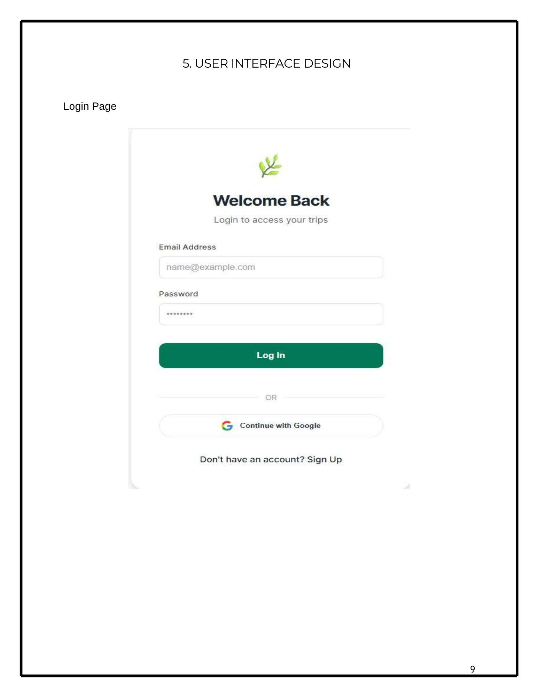
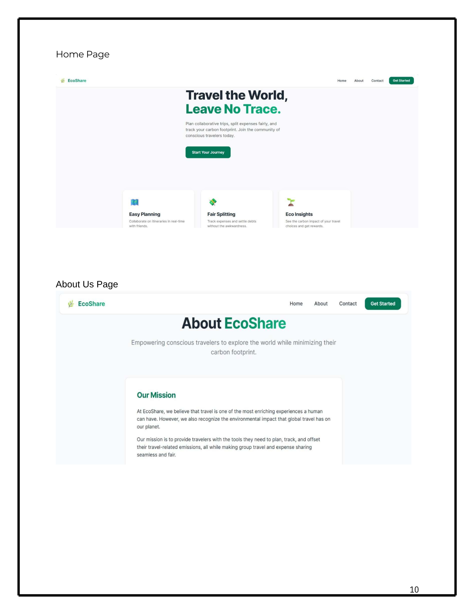
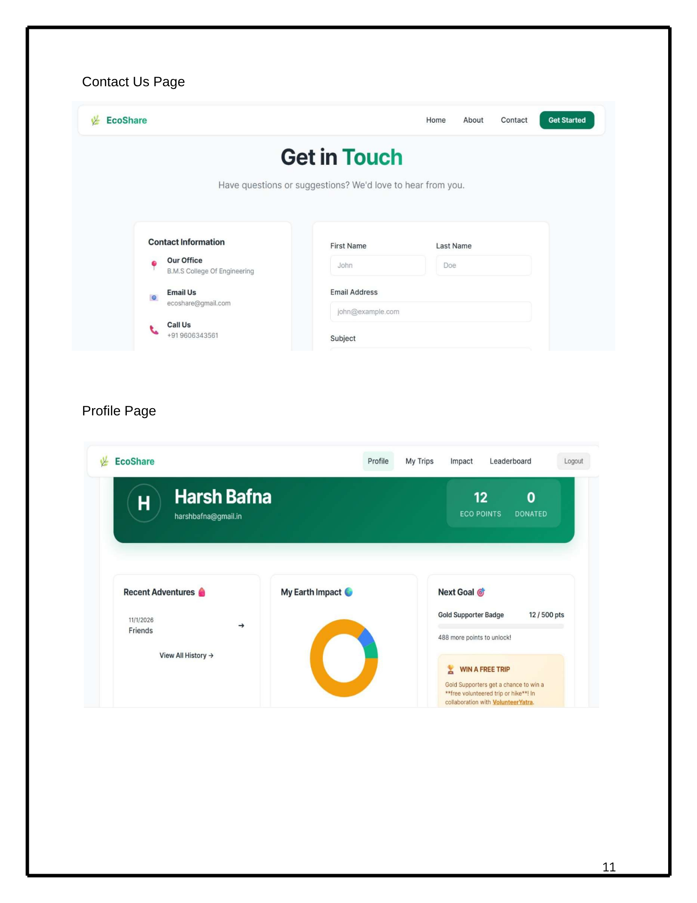
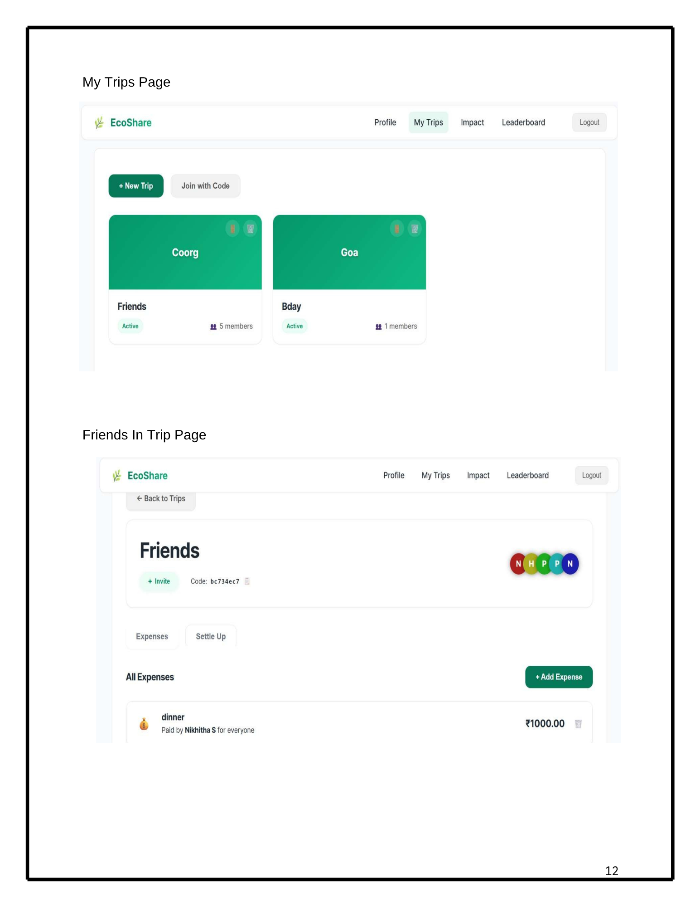
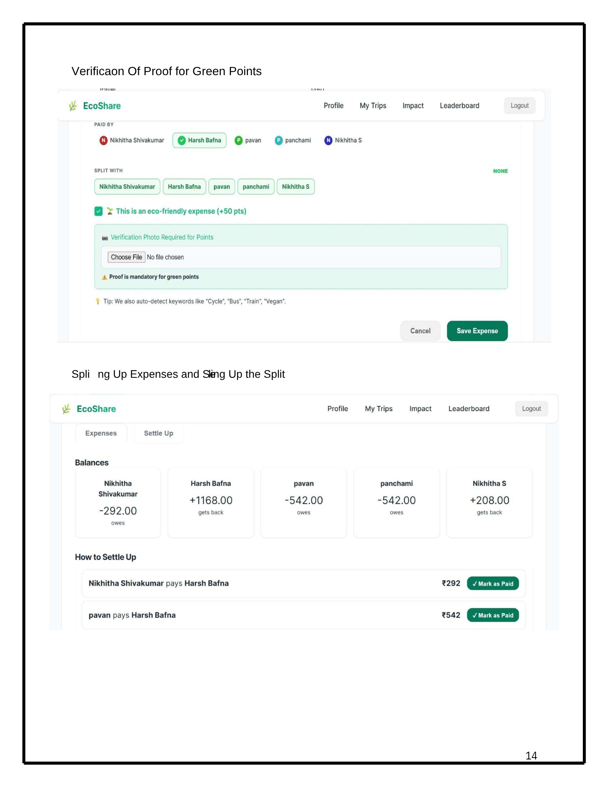
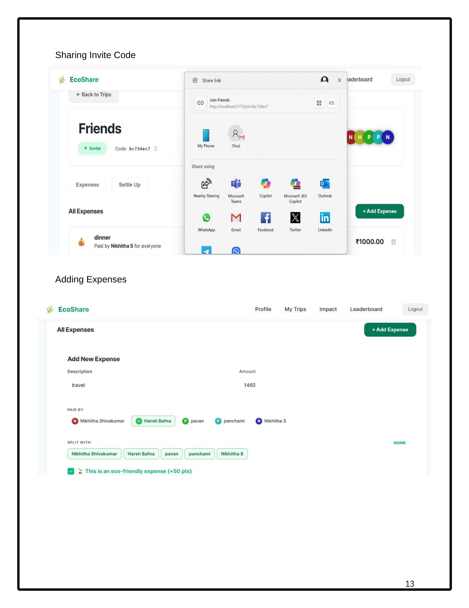
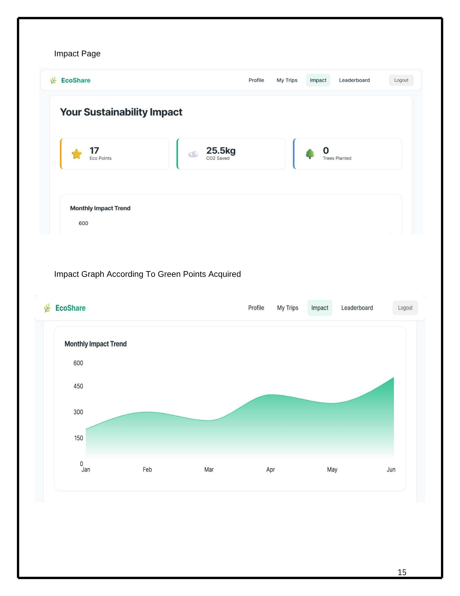
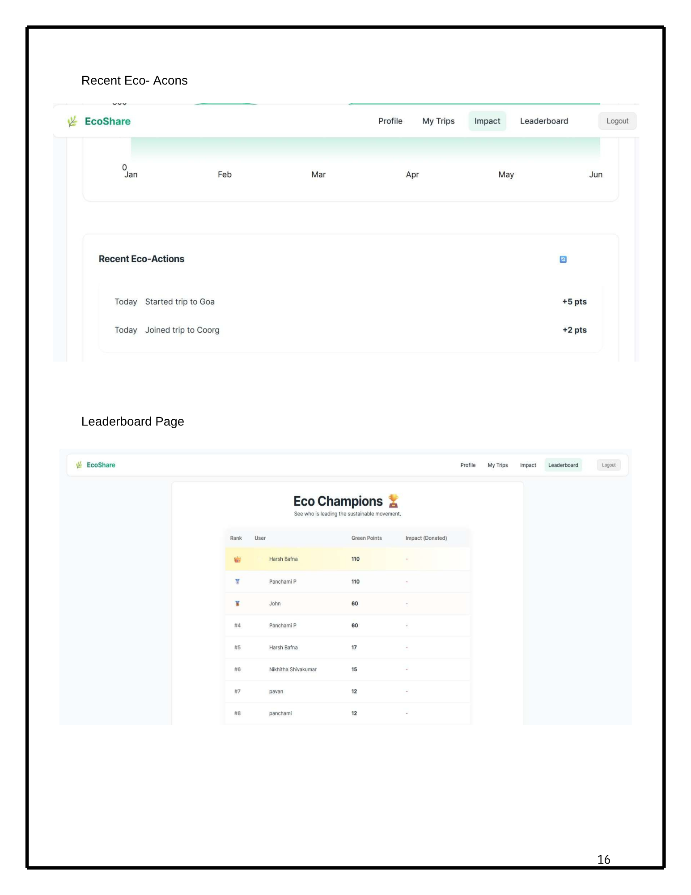

# EcoShare 🌱

EcoShare is a full-stack MERN application designed to simplify group travel expense management while promoting environmentally responsible decision-making.

It combines financial transparency with sustainability by assigning environmental impact scores to expenses and rewarding users with GreenPoints for eco-friendly choices.

---

## 🚀 Features

- Create and manage group trips  
- Add and split shared expenses automatically  
- Track balances and settlements in real-time  
- Environmental impact scoring for each expense  
- GreenPoints reward system for sustainable decisions  
- Leaderboards to encourage eco-friendly behavior  
- Dashboard for tracking spending and environmental impact  

---

## 💡 What Makes EcoShare Unique

Unlike traditional expense tracking apps, EcoShare integrates sustainability into financial decisions:

- 🌍 Tracks environmental impact of expenses  
- 🌱 Rewards eco-friendly choices with GreenPoints  
- 📊 Visualizes CO₂ savings and sustainability metrics  

---

## 🛠 Tech Stack

**Frontend**
- React.js (Vite)
- Tailwind CSS

**Backend**
- Node.js
- Express.js

**Database**
- MongoDB

**Authentication**
- JSON Web Tokens (JWT)

---

## 📸 UI Preview

### 🔐 Login Page


---

### 🏠 Home & About


---

### 👤 Dashboard / Profile


---

### 🧳 Trips Management


---

### 💸 Expense Management


---

### 🔄 Expense Sharing


---

### 🌍 Sustainability Impact


---

### 🏆 Leaderboard


---

## 🧩 Architecture Overview

The application follows a modular layered architecture:

- API Layer → Handles client requests  
- Authentication Layer → JWT-based access control  
- Business Logic Layer → Expense calculation & scoring  
- Database Layer → MongoDB data management  

---

## ⚙️ Setup Instructions

🌍 Vision

To build a platform that encourages responsible travel by combining financial clarity with environmental awareness.

🚧 Future Improvements
Integration with real CO₂ calculation APIs
Online payment gateway for settlements
Real-time notifications (WebSockets)
Mobile app using React Native
AI-based eco-friendly recommendations
🤝 Contributors
Harsh Bafna
Team EcoShare

```bash
git clone https://github.com/harshbafnacs24/EcoShare.git
cd EcoShare
npm install
npm run dev
